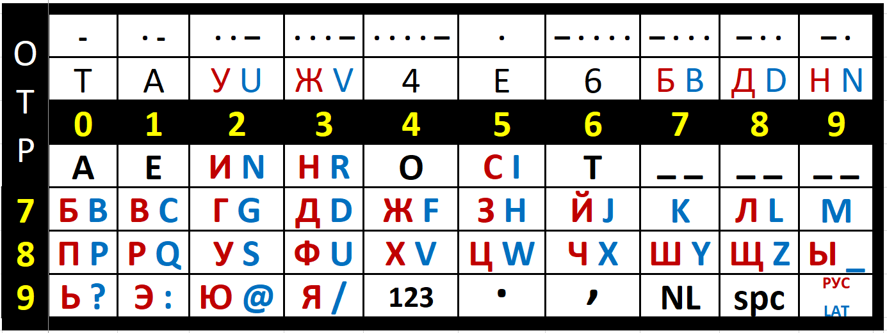

# SilentDuck-SampleOutput

SilentDuck-SampleOutput - A collection of fictional "reports" to get a feel for processing new enciphered messages when you do not know the contents.  These can be processed manually by hand or using the SilentDuck executable provided here in the "bin" folder.

These have been generated by AI using some scenarios generated by AI.  The reports were then enciphered using SilentDuck with the Trianon / TRIGON style keys provided here.

Cipher text is provided to ten scenarios with a number of messages each for practice.  We provide just the data for the message, instead of providing the ley count, message type and operator number, but we might have expected that if actually listening from a numbers station.

Finally, although I generated MP3 files, about ten megabytes each.  The idea was to use as much of the keypad sheet as possible without going over it when generating the ciphertext, then play the audio, repeating each line once with a one second delay between lines.

This gives us a 46 minute stream of Morse code at 13 words per minute, chosen because [Jack Barsky](https://en.wikipedia.org/wiki/Jack_Barsky) mentioned that in an interview.

The Morse code uses morse shorts, aka morse cuts, to represent digits which tend to be longer than letters in morse code.  They are described in more detail in the SilentDuck manual, along with the straddling checkerboard method of encoding characters as numerical digits.

Feel free to use and copy this OTP bookmark:

It provides the standard information you might need, and possibly forget.  Once you know how the straddling keyboard and Morse short system works, this bookmark makes it easy so you do not have to memorize the placement of numbers and letters.  Makes a fun fridge magnet.  I have carried one inside my transparent phone case for several years, and despite being visible, nobody has asked about it.  Kind of like how nobody will ask how a slide rule works, unless they are already into that sort of thing.  At least with this, the only math you need is addition and subtraction - no logarithms or batteries needed.
